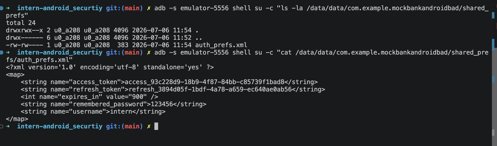
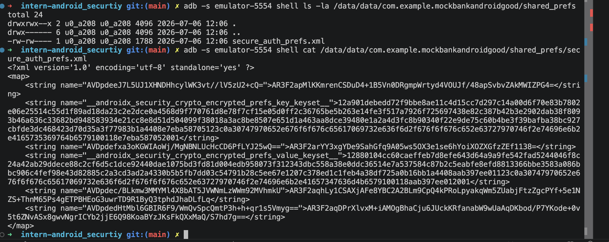

# P1 — Authentication Implementation & Local Storage Attack Demo

## Amaç

Bu bölümde Phase 1 Authentication kısmında öğrendiğim token storage konusunu pratikte test ettim.

Önce Android tarafında bilerek güvensiz bir uygulama oluşturdum. Bu uygulamada login sonrası backend’den gelen `accessToken`, `refreshToken` ve “remember me” açıksa password değerini düz `SharedPreferences` içine kaydettim.

Sonra aynı login akışını daha güvenli bir Android uygulamasında tekrar yaptım. Bu sefer token’ları `EncryptedSharedPreferences` içine kaydettim ve password’ü hiçbir şekilde persist etmedim.

Son olarak rootlu emulator üzerinden iki uygulamanın `/data/data/<package>/shared_prefs/` klasörlerini okuyarak farkı gözlemledim.

Bu çalışmadaki ana soru şuydu:

```text
Token'lar Android cihazda plaintext saklanırsa ne olur?
EncryptedSharedPreferences kullanınca rootlu cihazda dosya okunsa bile token görünür mü?
```

---

# 0. Backend Hazırlığı — MockBankApi (.NET)

## 0.1 Amaç

Android tarafında v1 ve v2 token storage testlerini yapabilmek için önce basit bir backend oluşturdum.

Bu backend’in amacı gerçek bir bankacılık sistemi yazmak değildi. Amacım sadece Phase 1 Authentication akışlarını test edebileceğim küçük bir API oluşturmaktı.

Backend ile şu akışları test ettim:

```text
Login ol.
Access token ve refresh token al.
Access token ile korumalı endpoint'e istek at.
Refresh token ile yeni access token al.
Logout ile token'ı server tarafında geçersiz kıl.
```

Bu backend sayesinde Android uygulamasının login sonrası aldığı token’ları nerede ve nasıl sakladığını test edebildim.

---

## 0.2 .NET Backend Projesi Oluşturma

Terminalde staj projemin ana klasörüne geldim.

```bash
cd intern-android_security
```

Daha sonra backend için yeni bir klasör oluşturdum:

```bash
mkdir MockBankApi
cd MockBankApi
```

Boş bir ASP.NET Core projesi oluşturdum:

```bash
dotnet new web
```

Bu komut minimal bir `.NET Web API` projesi oluşturdu.

Proje oluşunca backend’i çalıştırdım:

```bash
dotnet run
```

Backend şu adreste ayağa kalktı:

```text
http://localhost:5003
```

Terminalde şu çıktıyı gördüm:

```text
Now listening on: http://localhost:5003
```

Bu çıktı backend’in localde çalıştığını gösterdi.

---

## 0.3 Backend Dosya Yapısı

Backend projesinin temel dosyaları şöyleydi:

```text
MockBankApi/
├── MockBankApi.csproj
├── Program.cs
├── Properties/
└── appsettings.json
```

Bu çalışmada asıl düzenlediğim dosya:

```text
Program.cs
```

Minimal API kullandığım için endpointlerin tamamını `Program.cs` içine yazdım.

---

## 0.4 Program.cs İçinde Ne Yaptım?

`Program.cs` içinde önce basit bir kullanıcı listesi oluşturdum.

```csharp
var users = new Dictionary<string, User>
{
    ["intern"] = new User(
        Username: "intern",
        Password: "123456",
        Balance: 1250
    )
};
```

Bu gerçek database değildi. Demo basit kalsın diye kullanıcıyı memory içinde tuttum.

Kullanıcı bilgisi:

```text
username: intern
password: 123456
balance: 1250
```

Sonra access token ve refresh token’ları tutmak için iki ayrı memory map oluşturdum:

```csharp
var accessTokens = new ConcurrentDictionary<string, TokenRecord>();
var refreshTokens = new ConcurrentDictionary<string, TokenRecord>();
```

Burada:

```text
accessTokens  → kısa ömürlü access token kayıtları
refreshTokens → daha uzun ömürlü refresh token kayıtları
```

Token’lar gerçek database’e değil, uygulama çalıştığı sürece RAM’e kaydedildi. Backend kapanınca bu token kayıtları da sıfırlanıyor.

---

## 0.5 Eklediğim Endpointler

Backend içinde 4 endpoint oluşturdum:

```text
POST /login
GET /balance
POST /refresh
POST /logout
```

Bu endpointler Phase 1 Authentication testleri için yeterli oldu.

---

## 0.6 POST /login

`/login` endpoint’i username ve password alıyor.

Örnek request:

```http
POST /login
Content-Type: application/json

{
  "username": "intern",
  "password": "123456"
}
```

Eğer username/password doğruysa backend iki token üretiyor:

```text
access token
refresh token
```

Demo için token’ları `Guid.NewGuid()` ile random string olarak ürettim:

```csharp
var accessToken = $"access_{Guid.NewGuid()}";
var refreshToken = $"refresh_{Guid.NewGuid()}";
```

Örnek response:

```json
{
  "accessToken": "access_93c228d9-18b9-4f87-84bb-c85739f1bad8",
  "refreshToken": "refresh_3894d05f-1bdf-4a78-a659-ec640ae0ab56",
  "expiresIn": 900
}
```

Burada `expiresIn: 900`, access token’ın 900 saniye yani 15 dakika geçerli olduğunu göstermek için kullanıldı.

Bu demo token’lar JWT değildi. Daha çok opaque token gibi çalıştı. Yani token’ın içinde user bilgisi yoktu; backend token’ı memory map içinde arayıp hangi kullanıcıya ait olduğunu buldu.

---

## 0.7 GET /balance

`/balance` endpoint’i korumalı endpoint olarak tasarlandı.

Yani direkt çağırınca çalışmıyor. Request içinde access token bekliyor.

Token şu header ile gönderiliyor:

```http
Authorization: Bearer access_...
```

Örnek request:

```bash
curl http://localhost:5003/balance \
  -H "Authorization: Bearer access_..."
```

Backend şu kontrolleri yapıyor:

```text
Authorization header var mı?
Bearer token formatında mı?
Token accessTokens içinde kayıtlı mı?
Token expire olmuş mu?
```

Token geçerliyse bakiye dönüyor:

```json
{
  "balance": 1250,
  "currency": "TRY"
}
```

Bu endpoint sayesinde Android app’in login sonrası access token ile veri çekmesini test ettim.

---

## 0.8 POST /refresh

`/refresh` endpoint’i refresh token alıyor ve yeni access token üretiyor.

Örnek request:

```http
POST /refresh
Content-Type: application/json

{
  "refreshToken": "refresh_..."
}
```

Backend şu kontrolleri yapıyor:

```text
Refresh token kayıtlı mı?
Refresh token expire olmuş mu?
```

Refresh token geçerliyse yeni access token üretiyor:

```json
{
  "accessToken": "access_new...",
  "expiresIn": 900
}
```

Bu endpoint ile şunu test ettim:

```text
Kullanıcı tekrar username/password göndermeden refresh token ile yeni access token alabiliyor.
```

Bu yüzden refresh token’ın access token’dan daha kritik olduğunu tekrar görmüş oldum.

---

## 0.9 POST /logout

`/logout` endpoint’i logout sırasında token’ları server tarafında geçersiz kılmak için kullanıldı.

İlk başta sadece refresh token’ı siliyordu. Daha sonra access token’ı da Authorization header’dan alıp silecek şekilde güncelledim.

Örnek logout request:

```bash
curl -X POST http://localhost:5003/logout \
  -H "Content-Type: application/json" \
  -H "Authorization: Bearer access_..." \
  -d '{"refreshToken":"refresh_..."}'
```

Bu endpoint şunları yapıyor:

```text
Body içindeki refresh token'ı refreshTokens listesinden siliyor.
Authorization header içindeki access token'ı accessTokens listesinden siliyor.
```

Logout sonrası aynı refresh token ile tekrar `/refresh` çağırdığımda backend `401 Unauthorized` döndürdü.

Bu şu sonucu gösterdi:

```text
Logout sadece client tarafında token silmek değildir.
Server tarafında token invalidation da yapılmalıdır.
```

---

## 0.10 Backend’i Curl ile Test Etme

Backend’i Android app’e bağlamadan önce terminalden `curl` ile test ettim.

Önce login endpoint’ini çağırdım:

```bash
curl -X POST http://localhost:5003/login \
  -H "Content-Type: application/json" \
  -d '{"username":"intern","password":"123456"}'
```

Beklenen response:

```json
{
  "accessToken": "access_...",
  "refreshToken": "refresh_...",
  "expiresIn": 900
}
```

Sonra aldığım access token ile `/balance` çağırdım:

```bash
curl http://localhost:5003/balance \
  -H "Authorization: Bearer access_..."
```

Beklenen response:

```json
{
  "balance": 1250,
  "currency": "TRY"
}
```

Sonra refresh token ile yeni access token aldım:

```bash
curl -X POST http://localhost:5003/refresh \
  -H "Content-Type: application/json" \
  -d '{"refreshToken":"refresh_..."}'
```

Beklenen response:

```json
{
  "accessToken": "access_new...",
  "expiresIn": 900
}
```

Son olarak logout testini yaptım:

```bash
curl -X POST http://localhost:5003/logout \
  -H "Content-Type: application/json" \
  -H "Authorization: Bearer access_..." \
  -d '{"refreshToken":"refresh_..."}'
```

Logout sonrası aynı refresh token ile tekrar `/refresh` çağırdım:

```bash
curl -i -X POST http://localhost:5003/refresh \
  -H "Content-Type: application/json" \
  -d '{"refreshToken":"refresh_..."}'
```

Beklediğim sonuç:

```text
HTTP/1.1 401 Unauthorized
```

Bu çıktı server-side logout invalidation’ın çalıştığını gösterdi.

---

## 0.11 Android Emulator’dan Backend’e Erişim

Backend bilgisayarımda şu adreste çalışıyordu:

```text
http://localhost:5003
```

Ama Android emulator içinden `localhost` yazarsam bu bilgisayarımı değil, emulator’ın kendi içini gösterir.

Bu yüzden Android app içinde base URL olarak şunu kullandım:

```kotlin
private const val BASE_URL = "http://10.0.2.2:5003"
```

`10.0.2.2`, Android emulator’ın host makinedeki localhost’a ulaşmak için kullandığı özel IP’dir.

Yani Android app şu adrese istek attı:

```text
http://10.0.2.2:5003/login
```

Bu sayede emulator’daki Android app, bilgisayarda çalışan `.NET` backend’e ulaşabildi.

---

## 0.12 Bu Backend Bu Çalışmada Neyi Sağladı?

Bu backend benim için test ortamı oldu.

Aynı backend’i iki farklı Android app ile kullandım:

```text
MockBankAndroidBAD
MockBankAndroidGOOD
```

BAD app login oldu ve token’ları plaintext `SharedPreferences` içine yazdı.

GOOD app login oldu ve token’ları `EncryptedSharedPreferences` içine yazdı.

Yani backend tarafı aynı kaldı, Android tarafındaki token storage davranışı değişti.

Bu sayede şu karşılaştırmayı net yapabildim:

```text
Aynı login response.
Aynı access token / refresh token mantığı.
Farklı Android storage yöntemi.

v1: Plain SharedPreferences → token/password görünüyor.
v2: EncryptedSharedPreferences → token/password plaintext görünmüyor.
```

---

# 1. v1-vulnerable App: MockBankAndroidBAD

## 1.1 Amaç

Bu uygulamada bilerek kötü token storage yaptım.

Amacım şuydu:

```text
Login sonrası token'lar düz SharedPreferences'a yazılırsa,
rootlu cihazda bu dosya okunabilir mi?
```

---

## 1.2 Android Studio’da Proje Oluşturma

Android Studio’da yeni proje oluşturdum:

```text
New Project
→ Empty Activity
→ Name: MockBankAndroidBAD
→ Package name: com.example.mockbankandroidbad
→ Language: Kotlin
→ Minimum SDK: API 29
→ Finish
```

Bu proje `v1-vulnerable` uygulaması oldu.

---

## 1.3 Manifest Ayarları

Uygulamanın backend’e istek atabilmesi için `AndroidManifest.xml` dosyasına internet izni ekledim.

Dosya yolu:

```text
app/src/main/AndroidManifest.xml
```

Eklediğim permission:

```xml
<uses-permission android:name="android.permission.INTERNET" />
```

Backend localde HTTP çalıştığı için v1’de cleartext trafiğe de izin verdim.

`application` tag’ine şunu ekledim:

```xml
android:usesCleartextTraffic="true"
```

Sonuç olarak manifest kabaca şöyle oldu:

```xml
<manifest xmlns:android="http://schemas.android.com/apk/res/android">

    <uses-permission android:name="android.permission.INTERNET" />

    <application
        android:usesCleartextTraffic="true"
        android:allowBackup="true"
        android:theme="@style/Theme.MockBankAndroidBAD"
        android:label="@string/app_name">

        <activity
            android:name=".MainActivity"
            android:exported="true">
            <intent-filter>
                <action android:name="android.intent.action.MAIN" />
                <category android:name="android.intent.category.LAUNCHER" />
            </intent-filter>
        </activity>

    </application>
</manifest>
```

Buradaki `usesCleartextTraffic="true"` Phase 1 için zorunlu değil ama backend HTTP olduğu için bu testte gerekliydi. Güvenlik açısından bu ayar Phase 2’de ayrıca ele alınacak.

---

## 1.4 BAD App Login Akışı

`MainActivity.kt` içinde basit bir login ekranı oluşturdum.

Ekranda şunlar vardı:

```text
Username input
Password input
Remember me checkbox
Login button
Result text
```

Login butonuna basınca Android app şu endpoint’e istek attı:

```text
POST http://10.0.2.2:5003/login
```

Gönderilen örnek body:

```json
{
  "username": "intern",
  "password": "123456"
}
```

Backend başarılı response olarak token döndü:

```json
{
  "accessToken": "access_...",
  "refreshToken": "refresh_...",
  "expiresIn": 900
}
```

---

## 1.5 BAD App’te Token’ları Plaintext Saklama

v1’de token’ları bilerek düz `SharedPreferences` içine yazdım.

Kullandığım prefs dosya adı:

```kotlin
private const val PREFS_NAME = "auth_prefs"
```

Token kaydetme mantığı:

```kotlin
val prefs = context.getSharedPreferences(PREFS_NAME, Context.MODE_PRIVATE)

prefs.edit()
    .putString("access_token", accessToken)
    .putString("refresh_token", refreshToken)
    .putInt("expires_in", expiresIn)
    .putString("username", username)
    .apply()
```

Ayrıca “remember me” açıksa password’ü de sakladım:

```kotlin
if (rememberMe) {
    prefs.edit()
        .putString("remembered_password", password)
        .apply()
}
```

Bu bilerek kötü bir davranıştı. Çünkü token ve password disk üzerinde plaintext durdu.

---

## 1.6 BAD App’i Çalıştırma

Backend açıkken BAD app’i emulator’da çalıştırdım.

Backend terminalinde:

```bash
dotnet run
```

Android app’te login’e bastığımda ekranda şu sonucu gördüm:

```text
Login success.

accessToken saved to SharedPreferences.
refreshToken saved to SharedPreferences.
rememberMe: true

This is intentionally insecure v1 behavior.
```

---

# 2. Rootlu Emulator ile BAD App Dosyasını Okuma

## 2.1 Önce Root Kontrolü

Rootlu emulator’da adb shell’i root olarak çalıştırdım:

```bash
adb devices
adb -s emulator-5554 root
adb -s emulator-5554 shell id
```

Beklediğim çıktı:

```text
uid=0(root)
```

Bu çıktı geldikten sonra artık her komutta `su -c` kullanmama gerek kalmadı. `adbd` root olarak çalıştığı için dosyaları doğrudan okuyabildim.

---

## 2.2 BAD App SharedPreferences Dosyasını Okuma

BAD app’in package name’i:

```text
com.example.mockbankandroidbad
```

SharedPreferences dosyası şu path’teydi:

```text
/data/data/com.example.mockbankandroidbad/shared_prefs/auth_prefs.xml
```

Dosyayı okumak için şu komutu kullandım:

```bash
adb -s emulator-5554 shell cat /data/data/com.example.mockbankandroidbad/shared_prefs/auth_prefs.xml
```

Gördüğüm sonuçta token ve password plaintext olarak duruyordu.



**Gözlem:** v1 BAD uygulamasında `auth_prefs.xml` dosyasını rootlu emulator üzerinden okuduğumda `access_token`, `refresh_token`, `remembered_password` ve `username` değerleri plaintext olarak göründü. Bu, token ve password’ün düz `SharedPreferences` içinde saklandığını kanıtladı.

Bu v1’in temel zafiyetiydi.

---

# 3. v2-hardened App: MockBankAndroidGOOD

## 3.1 Amaç

Bu uygulamada aynı login akışını daha güvenli hale getirdim.

Amacım şuydu:

```text
Token'ları EncryptedSharedPreferences içine yazarsam,
rootlu cihazda dosya okunsa bile token plaintext görünür mü?
```

---

## 3.2 Android Studio’da GOOD Projesi Oluşturma

Android Studio’da ikinci bir proje oluşturdum:

```text
New Project
→ Empty Activity
→ Name: MockBankAndroidGOOD
→ Package name: com.example.mockbankandroidgood
→ Language: Kotlin
→ Minimum SDK: API 29
→ Finish
```

Bu proje `v2-hardened` uygulaması oldu.

---

## 3.3 Manifest Ayarları

BAD app’te olduğu gibi GOOD app için de internet izni ekledim.

Dosya:

```text
app/src/main/AndroidManifest.xml
```

Eklenen permission:

```xml
<uses-permission android:name="android.permission.INTERNET" />
```

Backend hâlâ HTTP çalıştığı için geçici olarak `usesCleartextTraffic` açık kaldı:

```xml
android:usesCleartextTraffic="true"
```

Bu ayar Phase 1 storage testi için kullanıldı. Network güvenliği Phase 2’de ayrıca düzeltilecek.

---

## 3.4 EncryptedSharedPreferences Dependency Ekleme

GOOD app’te `EncryptedSharedPreferences` kullanmak için Jetpack Security dependency ekledim.

Burada önemli nokta: Dependency project-level dosyaya değil, module-level dosyaya eklendi.

Doğru dosya:

```text
build.gradle.kts (Module :app)
```

Android Studio’da sol tarafta şu dosyayı açtım:

```text
Gradle Scripts
→ build.gradle.kts (Module :app)
```

`dependencies { ... }` bloğunun içine şunu ekledim:

```kotlin
implementation("androidx.security:security-crypto:1.1.0")
```

Örnek:

```kotlin
dependencies {
    implementation(libs.androidx.core.ktx)
    implementation(libs.androidx.lifecycle.runtime.ktx)
    implementation(libs.androidx.activity.compose)
    implementation(platform(libs.androidx.compose.bom))
    implementation(libs.androidx.ui)
    implementation(libs.androidx.ui.graphics)
    implementation(libs.androidx.ui.tooling.preview)
    implementation(libs.androidx.material3)

    implementation("androidx.security:security-crypto:1.1.0")
}
```

Sonra Android Studio’da çıkan:

```text
Sync Now
```

butonuna bastım.

---

## 3.5 GOOD App Login Akışı

GOOD app’te login akışı BAD app ile aynı kaldı.

Client yine şuraya istek attı:

```text
POST http://10.0.2.2:5003/login
```

Ama bu sefer token’ları düz `SharedPreferences` yerine `EncryptedSharedPreferences` içine yazdım.

---

## 3.6 MasterKey Oluşturma

Önce Android Keystore destekli bir master key oluşturdum:

```kotlin
val masterKey = MasterKey.Builder(context)
    .setKeyScheme(MasterKey.KeyScheme.AES256_GCM)
    .build()
```

Bu key, EncryptedSharedPreferences’ın verileri şifrelemek için kullandığı anahtar yapısının temelini oluşturur. Anahtar normal bir dosya gibi uygulama klasöründe tutulmaz; Android Keystore tarafından korunur.

---

## 3.7 EncryptedSharedPreferences Oluşturma

Sonra secure preferences objesini oluşturdum:

```kotlin
val securePrefs = EncryptedSharedPreferences.create(
    context,
    SECURE_PREFS_NAME,
    masterKey,
    EncryptedSharedPreferences.PrefKeyEncryptionScheme.AES256_SIV,
    EncryptedSharedPreferences.PrefValueEncryptionScheme.AES256_GCM
)
```

Burada kullandığım dosya adı:

```kotlin
private const val SECURE_PREFS_NAME = "secure_auth_prefs"
```

---

## 3.8 Token’ları Güvenli Saklama

Token’ları secure prefs içine yazdım:

```kotlin
securePrefs.edit()
    .putString("access_token", accessToken)
    .putString("refresh_token", refreshToken)
    .putInt("expires_in", expiresIn)
    .putString("username", username)
    .apply()
```

BAD app’ten farklı olarak password hiçbir şekilde saklanmadı.

Yani GOOD app’te şu yok:

```kotlin
.putString("remembered_password", password)
```

---

## 3.9 GOOD App’i Çalıştırma

GOOD app’i emulator’da çalıştırdım ve login’e bastım.

Ekranda şu sonucu gördüm:

```text
Login success.

accessToken saved to EncryptedSharedPreferences.
refreshToken saved to EncryptedSharedPreferences.
password was NOT persisted.

This is hardened v2 storage behavior.
```

---

# 4. Rootlu Emulator ile GOOD App Dosyasını Okuma

## 4.1 GOOD App Dosyasını Listeleme

GOOD app’in package name’i:

```text
com.example.mockbankandroidgood
```

SharedPreferences klasörünü listeledim:

```bash
adb -s emulator-5554 shell ls -la /data/data/com.example.mockbankandroidgood/shared_prefs
```

Dosya şu şekilde oluşmuştu:

```text
secure_auth_prefs.xml
```

---

## 4.2 GOOD App Secure Preferences Dosyasını Okuma

Dosyayı okumak için şu komutu kullandım:

```bash
adb -s emulator-5554 shell cat /data/data/com.example.mockbankandroidgood/shared_prefs/secure_auth_prefs.xml
```

Bu sefer dosya okunabildi ama token plaintext görünmedi.



**Gözlem:** v2 GOOD uygulamasında `secure_auth_prefs.xml` dosyasını rootlu emulator üzerinden okuyabildim; ancak `access_token`, `refresh_token`, `remembered_password` veya `123456` gibi plaintext değerler görünmedi. Dosyada sadece encrypted key/value değerleri ve AndroidX Security Crypto keyset kayıtları vardı.

---

# 5. v1 / v2 Karşılaştırması

| Konu | v1 BAD | v2 GOOD |
|---|---|---|
| Token storage | Plain SharedPreferences | EncryptedSharedPreferences |
| Access token | Plaintext | Encrypted |
| Refresh token | Plaintext | Encrypted |
| Password | Remember me ile plaintext saklandı | Hiç saklanmadı |
| Rootlu cihazda dosya okuma | Token/password direkt görünüyor | Ciphertext görünüyor |
| Disk güvenliği | Zayıf | Daha güçlü |
| Runtime saldırılar | Hâlâ mümkün | Hâlâ mümkün |

---

# 6. MASVS Mapping

Bu çalışma özellikle şu MASVS kategorileriyle ilişkilidir:

```text
MASVS-AUTH
MASVS-STORAGE
MASVS-CRYPTO
```

## MASVS-AUTH

Login, access token, refresh token, refresh flow ve logout akışı bu kategoriyle ilişkilidir.

Bu çalışmada server tarafında login sonrası token üretildi, access token ile korumalı endpoint çağrıldı, refresh token ile yeni access token alındı ve logout sırasında token invalidation test edildi.

## MASVS-STORAGE

Token ve password gibi hassas verilerin cihaz üzerinde nasıl saklandığı bu kategoriyle ilişkilidir.

v1 BAD uygulamasında access token, refresh token ve password düz `SharedPreferences` içinde plaintext saklandı. Rootlu emulator üzerinden bu değerler dosyadan okunabildi.

v2 GOOD uygulamasında token’lar `EncryptedSharedPreferences` içinde saklandı. Rootlu emulator üzerinden dosya okunabildi ama plaintext token/password görülmedi.

## MASVS-CRYPTO

`EncryptedSharedPreferences`, Android Keystore destekli encryption kullandığı için bu çalışma crypto tarafıyla da ilişkilidir.

Burada amaç kendi kripto algoritmamı yazmak değildi. Android’in sağladığı Keystore-backed encryption mekanizmasını kullanarak disk üzerindeki token sızıntısını azaltmaktı.

---

# 7. Sonuç

Bu testte aynı login akışını iki farklı Android uygulamasında denedim.

BAD app’te token’ları ve password’ü düz `SharedPreferences` içine yazdığım için rootlu emulator’da dosyayı okuyunca `access_token`, `refresh_token` ve `remembered_password` değerlerini plaintext olarak gördüm.

GOOD app’te ise token’ları `EncryptedSharedPreferences` içine yazdım ve password’ü hiç saklamadım. Rootlu emulator’da dosyayı okuyabildim ama token değerleri plaintext görünmedi; dosyada sadece encrypted key/value değerleri vardı.

Bu sonuç bana şunu gösterdi:

```text
Plain SharedPreferences token saklamak için güvenli değildir.
Keystore-backed encryption disk üzerindeki token sızıntısını azaltır.
Password hiçbir şekilde persist edilmemelidir.
```

Ama burada sınırı da not etmek gerekiyor:

```text
EncryptedSharedPreferences disk üzerindeki veriyi korur.
Uygulama token'ı API isteğinde kullanacağı anda token RAM'de plaintext hale gelir.
Rootlu cihazda Frida gibi runtime araçlarıyla bu token yine yakalanabilir.
```

Yani v2 disk güvenliğini ciddi şekilde artırdı ama rootlu cihaz/runtime saldırılarına karşı tek başına mutlak koruma sağlamaz.
